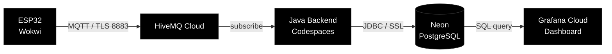
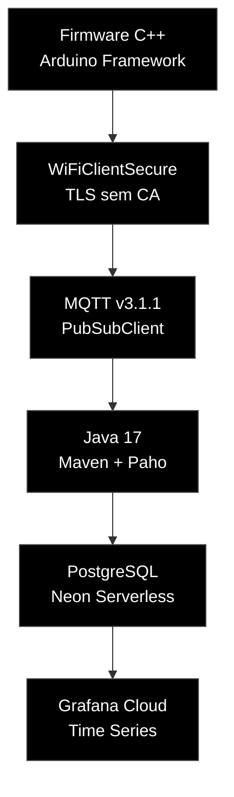
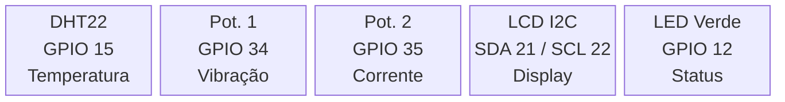

<div align="center">

# Do Sensor à Nuvem
### Telemetria Industrial em Tempo Real


**SENAI CentroWEG — Jaraguá do Sul, SC**  
Ryhan Gabriel Schutz · Técnico em CiberSistemas para Automação · 2026

</div>

---

## Arquitetura



---

## Stack



---

## Pinagem ESP32



---

## Payload

O ESP32 publica no tópico `senai/ryhan/motor/dados` no formato:

```
"27.5,42,18"
 └─┬─┘ └┬┘ └┬┘
   │    │   └── Corrente (A)
   │    └─────── Vibração (mm/s)
   └──────────── Temperatura (°C)
```

---

## Banco de dados

```sql
CREATE TABLE leituras (
    id          SERIAL PRIMARY KEY,
    timestamp   TIMESTAMPTZ DEFAULT NOW(),
    temperatura NUMERIC(5,2),
    vibracao    INTEGER,
    corrente    INTEGER
);
```

---

## Execução

**Firmware**

Importe no Wokwi, monte o circuito e inicie a simulação.

**Backend Java**

```bash
mvn compile
mvn exec:java -Dexec.mainClass="br.com.senai.automacao.App"
```

**Grafana**

```sql
SELECT
  timestamp   AS "time",
  temperatura AS "Temperatura (°C)",
  vibracao    AS "Vibração (mm/s)",
  corrente    AS "Corrente (A)"
FROM leituras
WHERE timestamp >= $__timeFrom() AND timestamp <= $__timeTo()
ORDER BY timestamp ASC;
```

---

## Dependências

```xml
<dependency>
    <groupId>org.eclipse.paho</groupId>
    <artifactId>org.eclipse.paho.client.mqttv3</artifactId>
    <version>1.2.5</version>
</dependency>
<dependency>
    <groupId>org.postgresql</groupId>
    <artifactId>postgresql</artifactId>
    <version>42.7.3</version>
</dependency>
```

---

## Segurança

Canal TLS na porta 8883 com autenticação por credenciais tanto no ESP32 (`WiFiClientSecure`) quanto no Java (`SSLSocketFactory`). Conexão ao Neon com `sslmode=require`.

Em produção: Mosquitto local com certificados X.509 e autenticação mútua.

---

<div align="center">


*Código estruturado com auxílio da IA Claude (Anthropic).*  
*Arquitetura, integração e lógica definidas pelo autor.*

> `Ler → Compreender → Fazer.`

</div>
